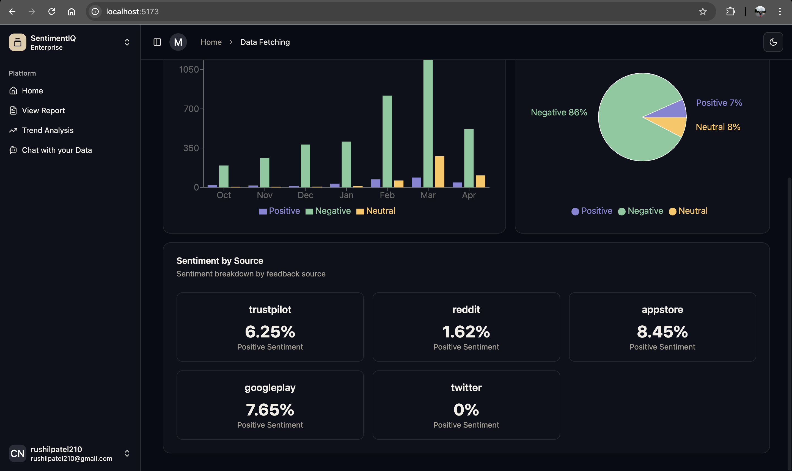
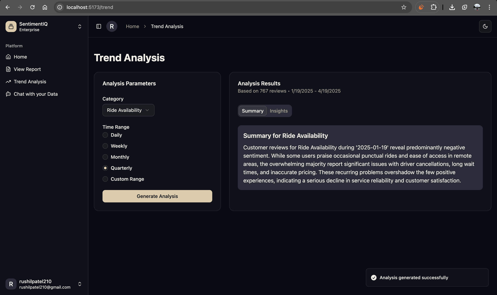
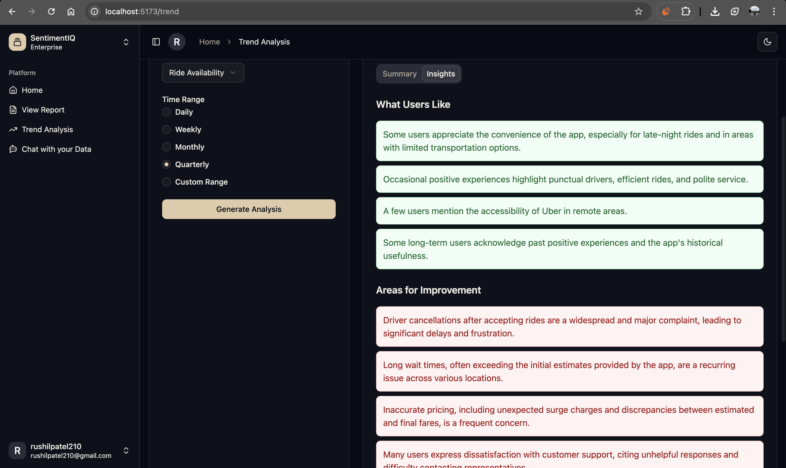
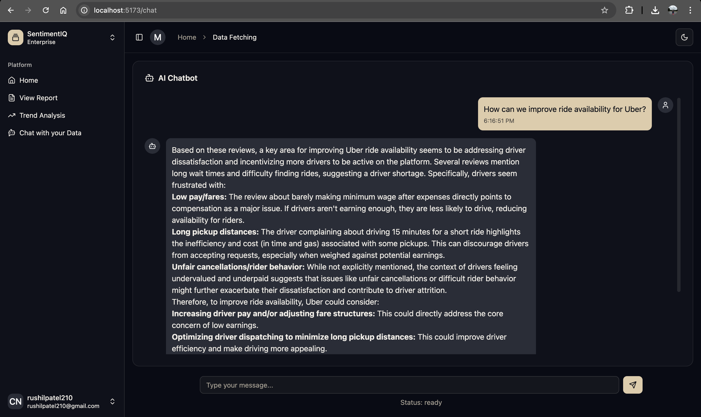
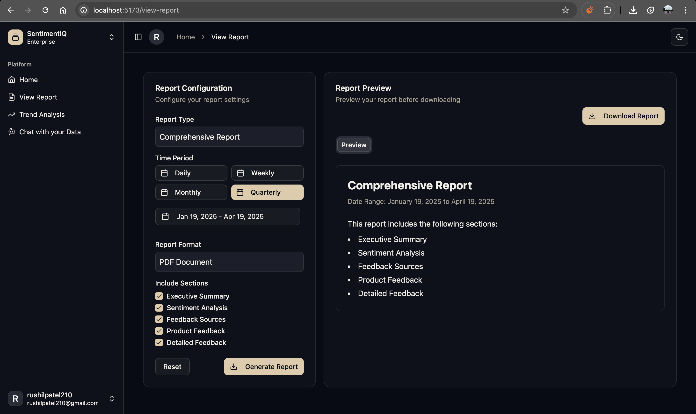

# Sentique

**Sentique** is a full‑stack feedback analytics platform that ingests user reviews from App Store, Google Play, Trustpilot, Reddit and Twitter/X, processes them with a fine‑tuned BERT model into 16 categories and sentiment labels, and provides comprehensive analytics and insights.

## Overview

Sentique transforms scattered customer feedback into actionable intelligence through sophisticated data processing and AI-powered analysis. The platform combines traditional machine learning with generative AI to deliver both structured analytics and conversational insights, helping businesses understand customer sentiment at scale.

## Key Features

- **Multi-Source Data Collection**: Automated scraping of reviews from App Store, Google Play, Trustpilot, Reddit, and Twitter/X
- **ML-Powered Classification**: Fine-tuned BERT model categorizes reviews into 16 distinct classes
- **Sentiment Analysis**: Identifies positive, negative, and neutral opinions across all feedback sources
- **Interactive Dashboards**: Real-time visualization of sentiment trends, source breakdowns, and feature-specific feedback
- **AI-Powered Insights**: Actionable summaries of what users like and areas for improvement via Gemini API
- **RAG-Driven Chatbot**: Natural language Q&A over vectorized review data using SentenceTransformer + Gemini

## System Architecture

### Backend Architecture

#### Data Collection Framework
- **Multi-Source Scrapers**: Specialized modules for each data source (App Store, Play Store, Reddit, Trustpilot, Twitter)
- **Asynchronous Processing**: Django + Celery architecture for efficient task queuing and execution
- **Error Handling**: Robust retry mechanisms for failed scraping attempts
- **Data Storage**: PostgreSQL database optimized for review data and analysis results

#### Machine Learning Pipeline
- **Sentiment Analysis**: Classifies reviews as positive, negative, or neutral
- **Category Classification**: Fine-tuned BERT model sorts reviews into 16 specific categories
- **Vector Embeddings**: Transforms review text into vector representations for similarity search
- **Model Persistence**: Efficient storage and retrieval of trained models

#### AI-Powered Insights
- **Gemini API Integration**: Generates comprehensive insights about specific feedback categories
- **Structured Analysis**: Creates organized summaries of positive and negative aspects
- **Time-Series Analysis**: Tracks sentiment changes and feature performance over time
- **Fallback Handling**: Alternative text extraction when primary parsing methods fail

#### RAG-Based Chatbot
- **Vector Search**: SentenceTransformer converts queries into searchable vectors
- **Contextual Retrieval**: Finds and ranks relevant reviews based on semantic similarity
- **Context Augmentation**: Enhances AI responses with retrieved review data
- **Response Generation**: Gemini API produces human-like answers grounded in actual review data

### Frontend Architecture

#### Component Structure
- **React + TypeScript**: Modern frontend with strong typing
- **Dashboard Views**: Main analysis dashboards with sentiment trends
- **Detailed Feedback Explorer**: Deep-dive interface for individual reviews
- **Product Feedback Analysis**: Category-specific review insights
- **Interactive Chat Interface**: Conversational UI for the RAG system

#### Visualization Components
- **Trend Charts**: Time-based visualization of sentiment patterns
- **Source Distribution**: Breakdown of sentiment by data source
- **Feature Analysis**: Comparative visualization of product features
- **Topic Modeling**: Visual representation of common themes in reviews

## Data Flow

1. **Collection**: Scrapers gather reviews from multiple platforms
2. **Processing**: ML models analyze sentiment and categorize reviews
3. **Enrichment**: Reviews are vectorized and stored with metadata
4. **Analysis**: Gemini API generates insights from processed data
5. **Presentation**: Frontend displays visualizations and interactive reports
6. **Interaction**: Users explore data and query the RAG chatbot

## Screenshots

### Dashboard Overview

*The main dashboard provides a comprehensive view of sentiment trends across time periods, sources, and categories. Key metrics are highlighted with interactive filtering capabilities.*

### Sentiment Analysis

*Detailed sentiment breakdown showing positive, negative, and neutral distribution across different sources and time periods, enabling targeted analysis of customer feedback patterns.*

### Actionable Insights

*Summarization of review distribution across the 16 categories identified by our fine-tuned BERT model, helping identify the most discussed aspects of products or services.*


*Actionable Insights of review distribution across the 16 categories identified by our fine-tuned BERT model, helping identify the most discussed aspects of products or services.*

### RAG-Based Chatbot Interface

*Natural language interface allowing users to query the review database conversationally, with responses generated by Gemini API using relevant review context.*

### Insights Report

*Summary report highlighting key strengths and improvement areas based on analysis of customer reviews across selected time periods and categories.*

## 💻 Technical Stack

- **Backend**: Django, Celery, PostgreSQL
- **Frontend**: React, TypeScript, Recharts
- **ML/AI**: Fine-tuned BERT, SentenceTransformer, Gemini API
- **Infrastructure**: Redis (Celery broker), Vector database capabilities

## 🚀 Project Setup Guide

### Notes
- Requires **pnpm**, **Node.js**, **Python 3.9+**
- On Windows, use `venv\Scripts\activate` instead of `source venv/bin/activate`
- Environment variables must be configured in `.env` file

### Frontend

1. Navigate to the frontend directory:
   ```sh
   cd frontend
   ```

2. Install dependencies:
   ```sh
   pnpm install
   ```

3. Start the development server:
   ```sh
   pnpm dev
   ```

### Backend

1. Create and activate a virtual environment:
   ```sh
   python -m venv venv
   source venv/bin/activate  # For macOS/Linux
   # For Windows:
   # venv\Scripts\activate
   ```

2. Install required dependencies:
   ```sh
   pip install -r requirements.txt
   ```

3. Apply database migrations:
   ```sh
   python manage.py makemigrations
   python manage.py migrate
   ```

4. Run the celery worker:
   ```sh
   celery -A backend worker --loglevel=info
   ```

5. Run the development server:
   ```sh
   python manage.py runserver
   ```
